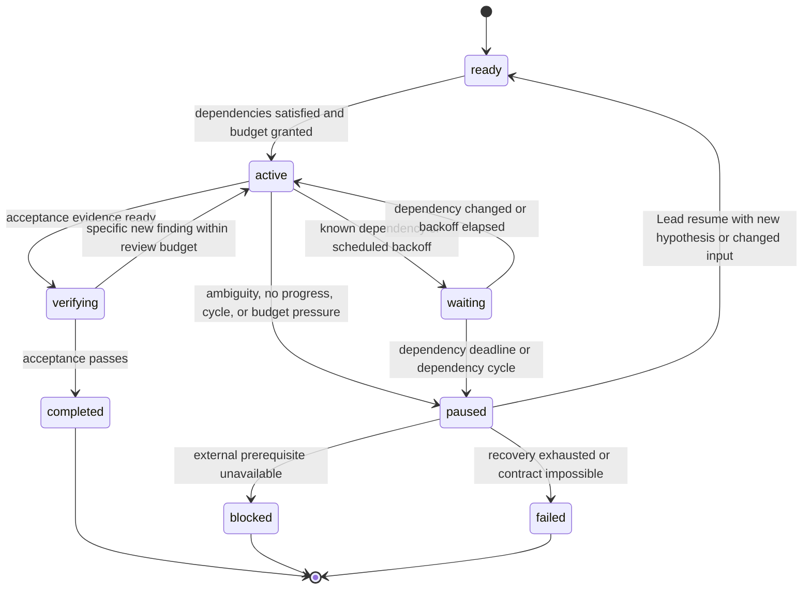

# Agent and Team Anti-Loop Design

Status: implemented
Date: 2026-09-08
Owner: AIGC Lead Codex

## Problem

An agent system can consume unbounded time or tool budget without improving the
user-visible result. The failure is not limited to repeated model text:

- an agent repeats a tool call with materially identical inputs after the same
  failure;
- an agent retries a transient operation forever, or retries a permanent error;
- a planner revises a plan without changing the unresolved constraint;
- two agents wait for each other, or delegate the same decision back and forth;
- an implementation and review cycle keeps reopening the same finding without
  new evidence;
- a worker waits silently for an unavailable dependency.

The control plane must stop these cases while preserving bounded, evidence-based
recovery from genuine transient failures.

## Decision

Use one coordinator-owned execution ledger for every task and subtask. Each
attempt must have a bounded budget, a declared expected progress signal, an
idempotency key, and a recorded outcome. The coordinator permits another step
only when the prior step made observable progress or a documented retry policy
allows it.

Agents remain responsible for task reasoning. The control plane owns termination,
budgets, dependency resolution, and escalation. It never asks a worker to keep
trying without a new hypothesis, changed input, or elapsed retry window.

Existing AIGC harness conventions are the persistence baseline:

- atomic, durable state after each stage;
- immutable input fingerprint and idempotency key;
- explicit lifecycle state and sanitized evidence;
- reuse of matching terminal results;
- resume only from a durable checkpoint whose input fingerprint still matches;
- a stable recovery error when safe resumption is impossible.

## Scope and non-goals

This protocol governs task orchestration, tool use, delegation, review, and
polling. It applies to a single agent and to the `aigc-core` lead/build/product/
quality topology.

It does not judge whether a creative response is good. A task can be complete
only against an explicit acceptance contract. Human approval remains required
where the task has irreducible product, policy, or preference ambiguity.

## Core terms

### Attempt

One execution of one action with a fixed action type, normalized input hash,
precondition set, and expected progress signal. Examples: call a provider,
read a required document, run one targeted test, request a review, or wait for
a known job.

### Progress event

A durable, verifiable change attributable to an attempt. At least one must be
present for an attempt to reset its no-progress counter:

1. a lifecycle transition accepted by the state machine;
2. a new content-addressed artifact, checkpoint, or test result;
3. a changed input/dependency fingerprint;
4. a newly resolved decision, blocker, or requirement with source evidence;
5. a changed failure classification supported by new observation.

Different prose, a new timestamp, or repeating an error message is not progress.
Neither is a cosmetic edit that does not affect the accepted deliverable.

### Materially identical attempt

An action with the same `task_id`, `action_type`, normalized `input_hash`,
precondition fingerprint, and target. It remains identical even when generated
text wording differs. A different retry sequence number alone does not make it
new work.

### New hypothesis

A concise claim that explains why the next attempt can produce a different
outcome. It must name the changed input, precondition, evidence, or elapsed
backoff window. The control plane rejects a retry that has no new hypothesis.

## Execution ledger

Persist one sanitized record per root task and subtask. Values are safe metadata:
never credentials, raw model/provider responses, local source paths, commands,
or user secrets.

```json
{
  "schema": "aigc-agent-run/v1",
  "run_id": "opaque-id",
  "parent_run_id": null,
  "task_id": "opaque-id",
  "owner": "aigc-build-codex",
  "acceptance_hash": "sha256",
  "input_fingerprint": "sha256",
  "state": "active",
  "budget": {
    "deadline_at": "2026-08-29T12:00:00Z",
    "max_actions": 24,
    "max_tool_calls": 16,
    "max_model_turns": 8,
    "max_delegations": 3,
    "max_review_rounds": 2,
    "max_no_progress": 2
  },
  "counters": {
    "actions": 0,
    "tool_calls": 0,
    "model_turns": 0,
    "delegations": 0,
    "review_rounds": 0,
    "consecutive_no_progress": 0
  },
  "dependencies": ["opaque-task-id"],
  "wait": {"deadline_at": "2026-08-29T12:00:00Z", "expected": "terminal"},
  "attempts": [],
  "last_progress": {
    "at": "2026-08-29T11:45:00Z",
    "kind": "checkpoint",
    "evidence_hash": "sha256"
  },
  "blocker": null,
  "escalation": null,
  "resolution": null
}
```

Each attempt appends: sequence number, actor, action type, normalized input
hash, dependency fingerprint, expected progress kind, outcome class, evidence
hash, and whether it made progress. Append before making an externally visible
side effect; finalize atomically after the result. A crash therefore yields a
recoverable `attempt_started` record, never an ambiguous implicit retry.

## State machine



Only the coordinator may transition a task out of `paused`. Workers may enter
`waiting` only with a named dependency and a deadline. They may enter `blocked`
only with the exact missing prerequisite and evidence that it cannot be obtained
from available tools or repository context.

Terminal states are immutable for the same `(task_id, input_fingerprint,
acceptance_hash)`. A repeated submission returns its terminal record. Any
changed input or acceptance contract creates a new run linked to the prior run.

## Admission gates

Before dispatching an action, the coordinator evaluates these gates in order:

1. **Terminal/idempotency gate.** Return the matching terminal result. Do not
   rerun work that already has accepted evidence.
2. **Precondition gate.** Reject missing owner, acceptance contract, dependency
   identity, required permission, or required input. Convert it to a precise
   blocker; do not let the worker discover it repeatedly.
3. **Budget gate.** Reject the action if its deadline or any action/tool/model/
   delegation/review budget is exhausted. Move to `paused` with the counter
   snapshot.
4. **Duplicate gate.** Reject a materially identical attempt after a non-
   retryable outcome. For retryable outcomes, require the retry policy below.
5. **Progress gate.** Pause after `max_no_progress` consecutive completed
   attempts. Default: two. A retryable error does not reset the counter unless
   the retry changed a permitted progress signal.
6. **Dependency-cycle gate.** Build a directed graph from active/waiting runs.
   A self-edge or strongly connected component with two or more nodes pauses all
   members, assigns the lead as resolver, and records the cycle path.
7. **Side-effect gate.** Before irreversible/external work, require an
   idempotency key and a persisted `attempt_started` record. On recovery,
   inspect the remote/job state before submitting again.

The gate decision itself is recorded, so a repeated rejected action cannot become
an invisible loop.

## Retry and polling policy

Failures are classified before retry:

| Class | Examples | Action |
| --- | --- | --- |
| `transient` | timeout, rate limit, queued remote job, unavailable service | Retry only with exponential backoff, jitter, deadline, and provider-specific cap. Poll state; never resubmit the job until idempotency lookup proves no job exists. |
| `input_or_contract` | validation failure, unsupported capability, invalid plan | Do not retry unchanged. Pause and request a changed input or coordinator decision. |
| `permission_or_policy` | denied access, unsafe operation, missing approval | Block with the required approver or permission. |
| `environment` | missing binary, unreachable required local service | Run one bounded diagnostic. If unresolved, block or fail; do not reinstall/restart repeatedly. |
| `unknown` | incomplete evidence | Allow exactly one diagnostic action that must reduce uncertainty. Reclassify afterwards; otherwise pause. |

Default retry schedule: immediate first execution, then `min(30 s, 2^n s)` plus
0-20% jitter, at most three retries per `(action_type, input_hash)` and never
past the run deadline. A response that reports the same remote state and same
state fingerprint twice is no progress; pause after the configured no-progress
limit even when the polling cap has not been reached.

## Single-agent protocol

Every agent response that requests another action must include internally:

```text
objective: <acceptance-relevant goal>
action: <one atomic action>
expected_progress: <state | artifact | evidence | decision>
new_hypothesis: <why this can change outcome; omit for first attempt>
stop_condition: <success/failure condition for this action>
```

The runtime does not expose this control metadata to the end user unless it
escalates. The agent must stop and return `paused` when it cannot state an
expected progress signal. It must never treat narrative reconsideration as a
reason to repeat a tool call.

For read/search loops, deduplicate by normalized query plus corpus version. For
edit/test loops, require a changed source fingerprint before repeating the same
test after a failure. For model reflection loops, allow at most one self-review
pass per artifact version; further review needs new external evidence or a
specific failed acceptance criterion.

## Team protocol

### Ownership

The lead owns the root task, acceptance contract, dependency graph, budget
allocation, and all `paused`, `blocked`, `failed`, and terminal decisions.
Each subtask has exactly one worker owner. Quality is independent and cannot
silently delegate a finding back to Build; it sends a bounded finding to Lead.

A subtask handoff includes these fields:

```json
{
  "task_id": "opaque-id",
  "parent_task_id": "opaque-id",
  "owner": "aigc-quality-omp",
  "objective": "verify the named observable contract",
  "acceptance": ["specific evidence required"],
  "inputs": ["safe artifact references"],
  "dependencies": ["opaque task IDs"],
  "deadline_at": "timestamp",
  "budget": {"max_actions": 6, "max_no_progress": 1},
  "return_format": "finding | accepted | blocked"
}
```

A receiving agent must accept, reject as underspecified, or declare a concrete
blocker. It may not forward the handoff to another agent without Lead approval.
The Lead may create a new subtask only when it has a different owner, objective,
or acceptance criterion; reassigning the same unresolved work counts against
`max_delegations`.

### Waiting and dependencies

- Workers wait only for a named task ID, its expected terminal condition, and a
  deadline. “Waiting for feedback” without an identifier is rejected.
- A worker must return a checkpoint before waiting. It cannot keep polling a
  peer; the coordinator wakes dependents when the dependency fingerprint
  changes.
- Lead detects dependency cycles at every dispatch and every transition to
  `waiting`. For a cycle, Lead chooses one: remove a nonessential dependency,
  make the missing decision, merge duplicate tasks, or block on an external
  owner.
- Product supplies decision input; it cannot authorize production truth. Quality
  reports evidence; it cannot repeatedly demand unbounded redesign. Build owns
  only the implementation task assigned by Lead.

### Review loop

Each review finding is keyed by `finding_id` and includes affected behavior,
reproduction evidence, severity, required verification, and the source/artifact
fingerprint. Build responds once per finding with `fixed`, `not_reproducible`,
or `needs_decision`, including evidence.

Quality verifies the response against the changed fingerprint. A reopened
finding must contain new reproduction evidence or a failed required verification.
The same finding may reopen once. A second disagreement pauses the root task for
Lead adjudication; neither agent continues to argue or patch indefinitely.

## Escalation contract

`paused` is a successful safety outcome, not a silent failure. The coordinator
emits a concise escalation record and stores it on the run as `escalation`:

```json
{
  "state": "paused",
  "reason_code": "no_progress | budget_exhausted | dependency_cycle | dependency_deadline | deadline_exceeded | retry_exhausted | review_deadlock | ambiguous_contract",
  "last_successful_checkpoint": "safe evidence reference",
  "attempt_summary": {
    "actions": 4,
    "consecutive_no_progress": 2,
    "attempt_count": 4,
    "last_action": "tool",
    "last_target": "provider",
    "last_key": "sha256"
  },
  "what_changed": "none since attempt 4",
  "decision_needed": "one concrete question or option set",
  "resume_requirements": ["changed input or explicit Lead decision"]
}
```

Resume is a Lead-only API. `resume(task_id, hypothesis, budget?)` is the only
transition out of `paused` back to `ready`. A human or Lead reply may start a
new attempt only after this recorded decision. Escalate to the user only for an
external preference, approval, credential, policy, or unavailable resource that
the lead cannot resolve. Internal conflicts and dependency cycles go to Lead
first.

Waiting is not resume. `wake(task_id)` returns a waiting run to `ready` only
when every named dependency is terminal and the wait deadline has not elapsed.
Missing deadline, elapsed deadline, or a dependency cycle pauses the run.

## Recommended defaults

Defaults are caps, not targets. Lower them for side-effecting work.

| Scope | Actions | Tool calls | Model turns | No-progress attempts | Delegations | Review rounds |
| --- | ---: | ---: | ---: | ---: | ---: | ---: |
| Small read-only task | 8 | 6 | 4 | 2 | 0 | 0 |
| Implementation subtask | 24 | 16 | 8 | 2 | 1 | 1 |
| Root team task | 60 | 40 | 16 | 2 | 3 | 2 |
| External side effect | 8 | 5 | 4 | 1 | 0 | 0 |

Every run also needs a wall-clock deadline appropriate to the request. A budget
increase is a lead decision with a stated new hypothesis and must be recorded;
it cannot be an automatic rollover.

## Implementation outline

1. Add a coordinator-owned `AgentRunStore` beside the existing atomic harness
   state stores. Persist schema-versioned run records by opaque run ID.
2. Implement `admit_attempt(run, proposal)` as the only route that can issue a
   tool/delegation permit. It performs the seven admission gates and updates
   counters atomically.
3. Wrap tool and delegation adapters so they record `attempt_started`, then
   `attempt_finished` with an outcome class and evidence hash.
4. Recompute the active/waiting dependency graph on dispatch, wait, completion,
   and recovery. Use strongly connected components to identify cycles.
5. Make all asynchronous providers resumable by remote job ID and idempotency
   key. Poll a known job; do not submit a replacement based only on a timeout.
6. Add a coordinator event stream for `progress`, `paused`, `blocked`, and
   terminal events. Surface the escalation record to the Lead and only then to
   the user when required.

## Acceptance criteria

- [x] An identical terminal request returns the existing terminal record and
  does not invoke a tool, provider, or worker again.
- [x] A non-retryable failure cannot trigger a second materially identical
  action.
- [x] A transient failure retries no more than three times, honors backoff and
  deadline, and records each attempt. The first retry is immediate; later
  retries wait `min(30 s, 2^n s)`.
- [x] Two consecutive completed attempts with no valid progress event pause the
  run with a `no_progress` escalation record.
- [x] A remote operation with a recorded idempotency key is inspected before
  any recovery resubmission. Guard records `attempt_started`. Image and video
  adapters poll a persisted `provider_task_id` and do not submit a replacement
  job after process restart.
- [x] A two-node and a self dependency cycle are detected before further worker
  polling; each affected task is paused and the cycle path is recorded.
- [x] A worker cannot enter `waiting` without a named dependency and deadline.
- [x] A repeated review finding requires new evidence; the second disagreement
  is escalated to Lead rather than causing further autonomous review/patch
  rounds.
- [x] `paused` runs resume only through Lead `resume()` with a new hypothesis.
- [x] Completed runs are idempotent; a second `complete()` returns the terminal
  record.
- [x] State recovery after process interruption preserves counters, does not
  duplicate external side effects, and either resumes from a verified checkpoint
  or returns a stable recovery error. In-flight Studio jobs persist the original
  request, references, and provider task id; missing task ids fail as
  `interrupted_job` instead of resubmitting.
- [x] Ledger and escalation evidence exclude secrets, raw provider responses,
  local source paths, commands, and unbounded model transcripts.

## Risks and operating notes

Progress fingerprints must be semantic enough to identify a real input or state
change. Hashing raw text alone is insufficient because generated text can vary
without altering the underlying action. Normalize action parameters, target,
resolved dependency versions, and accepted artifact fingerprints before hashing.

A strict no-progress cap can stop slow but valid external jobs. Represent these
as a durable remote job state and use a bounded provider polling policy; only a
state transition or changed provider fingerprint counts as progress. Do not
reset counters merely because time elapsed.

Budget values should be observed in production and adjusted by task class. The
invariant remains fixed: a higher budget requires a recorded owner decision and
a stated reason, never automatic continuation.
